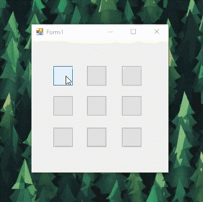
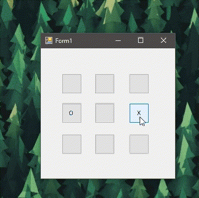

# C# Things

These are just some small things that I made while learning C# and .net basics.

**Disclaimer**: There are not very high quality codes but rather for recreational purpose. I used windows forms to create some games because I wanted to do it for fun.

## Some Examples

### Calculator

### Tic Tac Toe

#### Example 1

#### Example 2

### Hangman

#### Example 1

#### Example 2

*Uses cheat: Clicking on the Hangman pic shows the word in the bottom left corner of the window*
